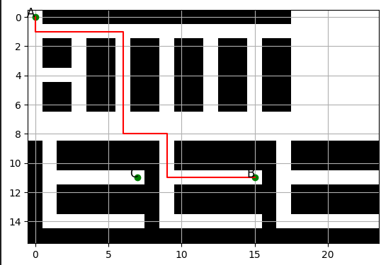

# Traveling Salesman Problem applied to warehouse orders
This repo contains the required elements to simulate the warehouse traveling salesman problem (TSP).
* Simple method for converting a floor plan to a 2D graph object
* Sample picking and location data
* Traveling Salesman and shortest path solver (using NetworkX)

  

<b>Scenario 1:</b> Calculating shortest path between the pickup point and a waypoint 

