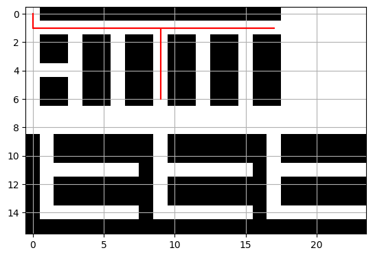

# methods = ["FIFO", "LIFO", "Deplete maximum number of Bins", "Deplete minimum number of Bins"]

## Method: FIFO
[{'item_code': 'Bayberry', 'qty': 0.2, 'warehouse': 'Fruit Basket 72 - CFC'},
 {'item_code': 'Butter', 'qty': 0.05, 'warehouse': 'Fruit Basket 41 - CFC'},
 {'item_code': 'Sugar', 'qty': 0.01, 'warehouse': 'Fruit Basket 21 - CFC'},
 {'item_code': 'Flour', 'qty': 0.1, 'warehouse': 'Fruit Basket 32 - CFC'}]

## Method: LIFO
[{'item_code': 'Sugar', 'qty': 0.01, 'warehouse': 'Fruit Basket 30 - CFC'},
 {'item_code': 'Flour', 'qty': 0.1, 'warehouse': 'Fruit Basket 38 - CFC'},
 {'item_code': 'Butter', 'qty': 0.05, 'warehouse': 'Fruit Basket 39 - CFC'},
 {'item_code': 'Bayberry', 'qty': 0.2, 'warehouse': 'Fruit Basket 69 - CFC'}]

## Method: Deplete maximum number of Bins
[{'item_code': 'Sugar', 'qty': 0.01, 'warehouse': 'Fruit Basket 21 - CFC'},
 {'item_code': 'Butter', 'qty': 0.05, 'warehouse': 'Fruit Basket 41 - CFC'},
 {'item_code': 'Flour', 'qty': 0.1, 'warehouse': 'Fruit Basket 51 - CFC'},
 {'item_code': 'Bayberry', 'qty': 0.2, 'warehouse': 'Fruit Basket 75 - CFC'}]

 

## Method: Deplete minimum number of Bins
[{'item_code': 'Sugar', 'qty': 0.01, 'warehouse': 'Fruit Basket 21 - CFC'},
 {'item_code': 'Butter', 'qty': 0.05, 'warehouse': 'Fruit Basket 41 - CFC'},
 {'item_code': 'Flour', 'qty': 0.1, 'warehouse': 'Fruit Basket 51 - CFC'},
 {'item_code': 'Bayberry', 'qty': 0.2, 'warehouse': 'Fruit Basket 75 - CFC'}]

